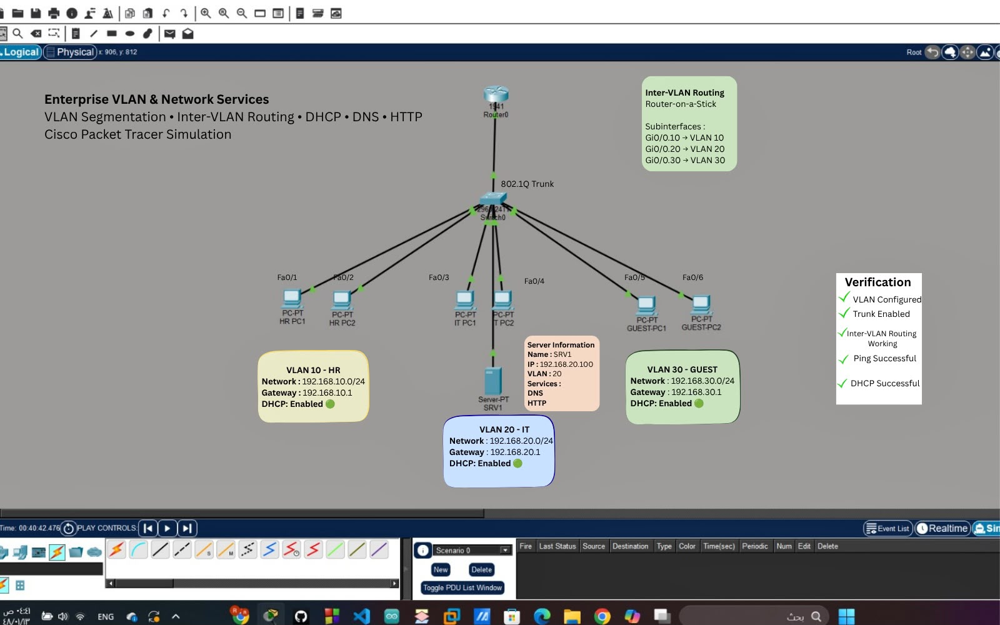

# Enterprise-Network-Services
Enterprise Network Services using NLANs , Inter-VLAN Routing , DHCP , DNS , and HTTP Server in Cisco Packet Tracer.
# Enterprise VLAN & Network Services

## Overview

This project demonstrates an enterprise network implemented in Cisco Packet Tracer using VLAN segmentation, Inter-VLAN Routing (Router-on-a-Stick), DHCP, DNS, and HTTP services.

## Network Topology

- 1 Router (Cisco 1941)
- 1 Layer 2 Switch (Cisco 2960)
- 1 Server
- 6 Client PCs
- 3 VLANs (HR, IT, Guest)

## Technologies Used

- VLAN Segmentation
- 802.1Q Trunking
- Inter-VLAN Routing
- DHCP
- DNS
- HTTP Server
- Cisco Packet Tracer

## VLAN Configuration

| VLAN | Department | Network |
|------|------------|----------------|
| 10 | HR | 192.168.10.0/24 |
| 20 | IT | 192.168.20.0/24 |
| 30 | Guest | 192.168.30.0/24 |

## Server Configuration

- IP Address: 192.168.20.100
- VLAN: 20
- Services:
  - DHCP
  - DNS
  - HTTP

## Project Verification

- VLANs configured successfully.
- 802.1Q trunk established.
- Inter-VLAN Routing operational.
- DHCP addressing verified.
- DNS resolution tested.
- HTTP service accessible.
- End-to-end connectivity confirmed.

## Files

- Enterprise-Network-Services.pkt
- Network-Topology.jpeg
